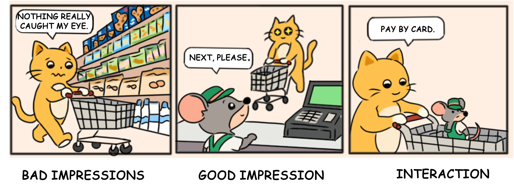
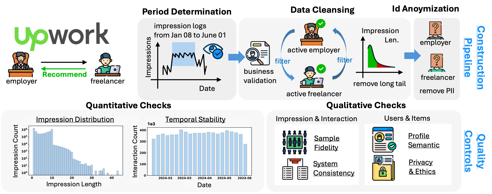

# UHD-demo
A Demo of the E-Recruitment Recommendation Dataset UHD

### Why Impressions Matter in Recommendations?

### Data Construction 

### Files
- behaviors-demo.tsv: User–item interaction logs with timestamps.
- impressions-demo.tsv: Item exposure logs
- freelancer_meta-demo.tsv: Anonymized and cleaned freelancer profiles (item features)
- sample.py: code to sample demo data/UHD-5K/UHD-50K from UHD-full

### Specification of the Impression data
impressions-demo.tsv

| Name | Description |
|------|-------------|
| **impression_id** | The anonymized identifier for the impression record. |
| **user_id** | The anonymized identifier for the user associated with this impression. |
| **impression_ts** | The timestamp when the impression is generated. |
| **impressions** | The list of items exposed to the user in this impression. |

### Specification of the Item Metadata
freelancer_meta.tsv

| Name | Description |
|------|-------------|
| **item_id** | The anonymized identifier for the freelancer. |
| **registration_date** | The registration date of this freelancer profile. |
| **job_title** | The title of job position this freelancer seek for. |
| **overview** | A self-introduction of this freelancer. |
| **skill_tags** | A list of skills. |
| **open_to_hire** | A flag indicates if this freelancer is open to hire. |
| **available_hours** | The duration since the profile available in hours. |

